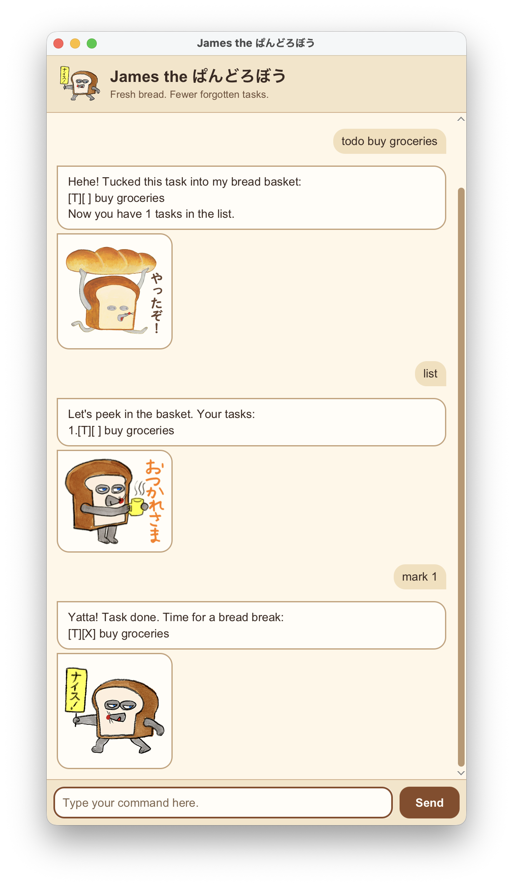

# James the ぱんどろぼう — User Guide

James is a playful bread-thief chatbot that keeps track of your tasks, deadlines, and events.

[Getting started](#getting-started) · [Commands](#commands) · [Saving and undo](#saving-and-undo)

## Getting started

With **JDK 25** installed, open a terminal in the project folder and run `./gradlew run`
(`gradlew.bat run` on Windows). Type a [command](#commands) into the chat box and press
**Enter** or click **Send**.

For IntelliJ IDEA, open the project, select **JDK 25** as the Project SDK and
**SDK default** as the language level, then run
[`Launcher.main()`](../src/main/java/james/gui/Launcher.java).
For the console interface, run [`James.main()`](../src/main/java/james/James.java) instead.

## Commands

**Notes about the command format:**

- Words in `UPPER_CASE` are required values you supply: `todo DESCRIPTION` becomes `todo read book`.
- Type command words and options such as `/by`, `/from`, and `/to` as shown.
  Keep parameters in the shown order; for events, `/from` must precede `/to`.
- Descriptions and search keywords may contain spaces; quotation marks are unnecessary.
- Dates use **`yyyy-mm-dd`**; an event must end after its start date.
- `list`, `undo`, `random_sticker`, and `bye` take no parameters. Extra arguments cause an error.
- No commands below have optional or repeatable parameters. Square brackets in task output
  indicate task type or completion status, as explained [below](#task-numbers).

| Action | Format | Example |
| --- | --- | --- |
| Add a task | `todo DESCRIPTION` | `todo read book` |
| Add a deadline | `deadline DESCRIPTION /by DATE` | `deadline submit report /by 2026-09-20` |
| Add an event | `event DESCRIPTION /from START_DATE /to END_DATE` | `event study camp /from 2026-09-21 /to 2026-09-23` |
| List all tasks | `list` | `list` |
| Search descriptions (case-insensitive, partial matches) | `find KEYWORD` | `find book` |
| Show deadlines due that day and events spanning it (inclusive) | `list_by_date DATE` | `list_by_date 2026-09-22` |
| Mark a task as done | `mark TASK_NUMBER` | `mark 1` |
| Mark a task as incomplete | `unmark TASK_NUMBER` | `unmark 1` |
| Delete a task | `delete TASK_NUMBER` | `delete 1` |
| [Undo the last task change](#saving-and-undo) | `undo` | `undo` |
| Show a random sticker in the chat window | `random_sticker` | `random_sticker` |
| Exit James | `bye` | `bye` |

### Task numbers

Use the numbers from the full `list`, starting at **1**, when marking,
unmarking, or deleting. Search and date results have their own numbering; run `list`
first to get the correct number. `[T]`, `[D]`, and `[E]` identify tasks, deadlines, and
events; `[X]` means done and `[ ]` means incomplete. Duplicate tasks are rejected.

## Saving and undo

Successful task changes are saved automatically to `data/james.txt`, relative to the
folder you launch James from, and loaded on the next launch.
Use `undo` repeatedly to reverse up to **20 task changes in the current session**
(add, delete, mark, or unmark). Undo also saves the restored tasks; its history clears
when James closes. There is no redo.
